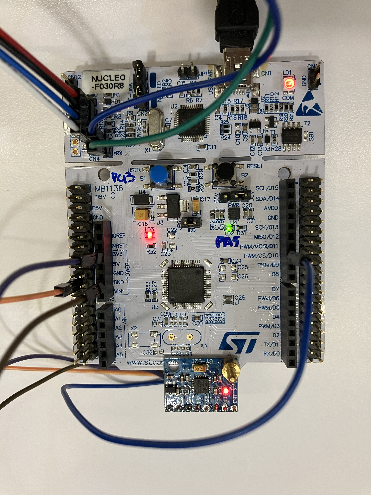
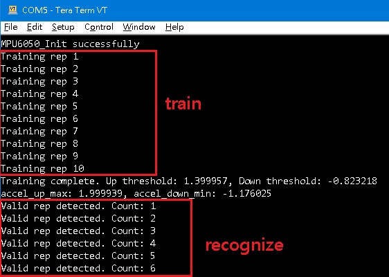

## Install Keil
[link](https://www2.keil.com/mdk5)  

## Install STM32 tools
[STM32CubeMX](https://www.st.com/en/development-tools/stm32cubemx.html)  

## Clone code
`git clone https://github.com/eiffelpeter/stm32_mpu6050_dumbbell.git`  

## Connect stm32 nucleo-F030R8 and mpu6050
  

## Pin connection for test
| Item | pin | 
|---------|-----|
| I2C SCL | PB6 |
| I2C SDA | PB7 |

## Generate code by STM32CubeMX
  open `stm32_mpu6050_dumbbell.ioc` then generate code.  

## Build and program it
  open `stm32_mpu6050_dumbbell.uvprojx` by Keil.  
  build and program stm32.  

## Open console log
  baud rate 115200.  
    
